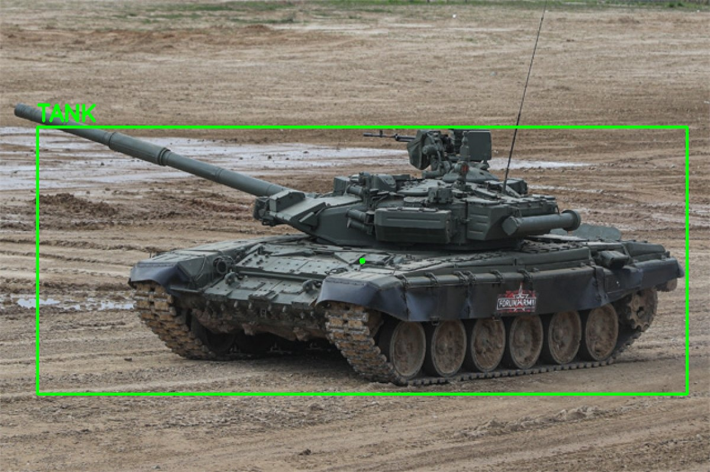

# Armored Vehicles Classification with YOLO

This project is a Python program that utilizes the YOLO model to classify armored vehicles in photos and videos. The program is capable of recognizing tanks, infantry fighting vehicles (IFVs), and armored personnel carriers (APCs), which could be used in military area - for example for FPV-kamikadze-drones programming. 

To upload weights to model: 
    ```
    https://drive.google.com/file/d/1pA9k5kqCmOK1UYL6AFAtZJlu9YG8A5TO/view?usp=sharing
    ```

## Installation

1. Install dependencies:

    ```bash
    pip install opencv-python
    pip install ultralytics
    ```

2. Download the pre-trained YOLO model and place it in the project directory. You can download the model from the [Ultralytics website](https://ultralytics.com/yolov5).

## Usage

1. Run the program by specifying the path to the image you want to classify:

    ```bash
    python classify_armor.py --image path/to/your/image.jpg
    ```

2. After running the program, you will receive the classification results in the console.

## Example



## Notes

- Make sure you have sufficient memory to run the YOLO model, especially if you plan to process large images.
- The YOLO model is trained to detect armored vehicles in general and may not be perfect for all scenarios. Fine-tuning on your own dataset may be required to improve accuracy.
- For best results, high-resolution images with good lighting are recommended.

## Authors

- Kucher Maks / Email: maxim.kucher2005@gmail.com


